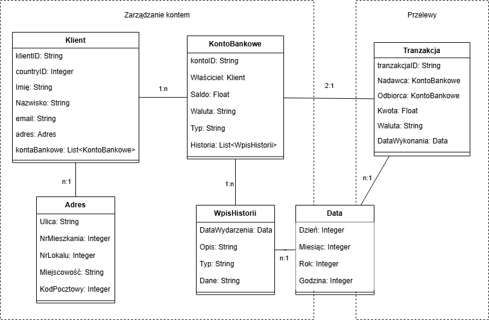

# Domain Driven Design - System bankowy

## Opis zadania

Treść zadania: Celem zadania jest zamodelowanie bezpiecznej aplikacji bankowej (fragmentu) wykorzystując zasady Domain Driven Design.

W zadaniu skupiłem się na dwóch przykładowych kontekstach, t.j.: Zarządzanie kontem oraz Przelewy. Poniżej prezentuję graf modelu DDD oraz krótkie opisy szczegółowe poszczególnych elementów modelu.

## Graf modelu

## Agregaty

1. **Klient**
   Klient jest podstawową częścią kontekstu Zarządzania Kontem. Encja definiuje klienta pod kątem jego danych osobowych oraz pilnuje posiadanych przez niego kont bankowych.

2. **Tranzakcja**
    Tranzakcja jest podstawową częścią kontekstu Przelewów. Encja definiuje wartości związane z danym przelewem/tranzakcją.

## Encje

Krótki opis elementów/obiektów wartości (OW) z których składają się encje (oraz ich ograniczenia w wartościach).

1. Klient
    - klientID - ID klienta w banku
        - wartość musi być unikalna w systemie (per instancję "Klient")
    - countryID - wyróżnik klienta w danym kraju (e.g. PESEL w Polsce, SSN w USA)
        - wymogi/ograniczenia na przechowywany numer są nadawane przez dany kraj
    - Imię
        - ograniczenie do 25 znaków, tylko litery alfabetu (alfabet zależny od kraju)
    - Nazwisko
        - ograniczenie do 35 znaków, tylko litery alfabetu (alfabet zależny od kraju)
    - email
        - ograniczenie do 75 znaków, musi być '@', po '@' musi być istniejąca i aktywna domena, znaki przed '@' mogą być tylko literami alfabetu, cyframi oraz '.', '-'i '_'
    - adres (OW) - adres zamieszkania/zameldowania klienta
        - jeden stały i poprawny adres nakażdego klienta (dodatkowe ograniczenia związane z OW)
    - kontaBankowe (OW) - lista kont bankowych posiadanych przez klienta
        - ograniczenia co do liczby posiadanych kont potencjalnie zależne od typów kont (dodatkowe ograniczenia związane z OW)

2. Tranzakcja
    - tranzakcjaID - ID tranzakcji w banku
        - wartość musi być unikalna w systemie (per instancję "Tranzakcja")
    - Nadawca (OW) - konto Bankowe Nadawcy
        - konto musi mieć możliwe środki do przesłania (dodatnie saldo, brak blokad, itd.) (dodatkowe ograniczenia związane z OW)
    - Odbiorca (OW) - konto Bankowe Odbiorcy
        - nie może być takie same jak konto Nadawcy (dodatkowe ograniczenia związane z OW)
    - Kwota
        - dokładność do dwóch cyfr po przecinku, kwota tranzakcji musi być mniejsza lub równa Saldu Nadawcy
    - Waluta - waluta w której ma być wykonana tranzakcja (w przypadku zmian walut zostaną naliczone dodatkowe koszta które muszą być pokryte przez Nadawcę)
        - określana międzynarodowym kodem (e.g. "PLN" lub "USD")
    - DataWykonania (OW)
        - musi to być dzisiejsza lub przyszła zaplanowana data i godzina (dodatkowe ograniczenia związane z OW)

## Obiekty Wartości

Poza podstawowymi wartościami (String, Integer, Float i podobne) mamy jeszcze bardziej specjalistyczne obiekty wartości:

1. KontoBankowe
    - kontoID - ID konta bankowego
        - wartość musi być unikalna w systemie (per instancję "KontoBankowe")
    - Właściciel (OW) - Klient będący właścicielem konta
    - Saldo - Ilość pieniędzy aktualnie przechowywana na danym koncie bankowym
        - wartość numeryczna z dokładnością do dwóch cyfr po przecinku
    - Waluta - waluta w której pieniądze na koncie są przechowywane
        - określana międzynarodowym kodem (e.g. "PLN" lub "USD")
    - Typ - typ konta (e.g. "Normalne" lub "Oszczędnościowe")
        - określane poprzez konkretny tekst zależny od typu konta
    - Historia (OW) - lista różnych wydarzeń na koncie
        - musi być przynajmniej jeden wpis informujący o dacie i godzinie założenia konta

2. Adres
    - Ulica - nazwa ulicy
        - ograniczenia takie same jakie są ogranieczenia nazywania ulic danego kraju
    - NrMieszkania - numer mieszkania na danej ulicy
        - liczba całkowita, większa niż zero
    - NrLokalu - numer lokalu w danym budynku
        - liczba całkowita, większa niż zero
    - Miejscowość - nazwa miasta zamieszkania
        - ograniczenia takie same jakie są ogranieczenia nazywania miejscowości danego kraju
    - KodPocztowy - kod pocztowy danej Miejscowości/regionu
        - cyfry po kolei tak jak w kodzie pocztowym (według wytycznych danego kraju)

3. WpisHistorii
    - DataWydarzenia (OW) - data i godzina w którym dane wydarzenie się odbyło
    - Opis - skrócony opis wydarzenia do wyświetlenia użytkownikowi
        - maksymalnie 500 znaków
    - Typ - typ wydarzenia (e.g. założenie konta, przelew normalny, przelew własny, likwidacja konta, itd.)
        - zapisane w formie kodu tekstowego danego wydarzenia
    - Dane - dodatkowe dane związane z wydarzeniem, używane celem zapamiętania i wyświetlenia szczegółów związanych z danym wydarzeniem
        - zawartość zależna od typu wydarzenia

4. Data
    - Dzień - dzień miesiąca
        - cyfra całkowita od 1 do 31
    - Miesiąc - nr miesiąca
        - cyfra całkowita od 1 do 12
    - Rok - rok
        - cyfra całkowita większa od 1900
    - Godzina - godzina i minuty
        - zapis w formacie "XXYY", gdzie 'XX' to godzina i ta wartość musi być pomiędzy '00', a '23', a 'YY' to minuty i ta wartość musi być pomiędzy '00', a '59'

## Możliwe operacje

Kilka przykładów możliwych operacji w kontekstach

1. Zarządzanie kontem
    - Założenie nowego konta przez klienta - klient może założyć nowe konto w danym banku, dane konto zostanie założone z wpisem w historii o szczegółach jego założenia
    - Przeglądanie historii konta - Klient może wyświetlić historię swoich kont w formie listy ze skróconymi opisami oraz wybrać dany element historii, aby zobaczyć szczegóły znimzwiązane

2. Przelewy
    - Możliwość wykonania przelewu z konta klienta na inne konto (również inne konto klienta) - klient może wybrać z którego swojego konta na które (również swoje) konto chce przelać środki i jeżeli dane są poprawne (w tym klient posiada środki na wykonanie przelewu) to przelew może dojść do skutku. (Szczegóły przelewu zostaną zapisane w historii)